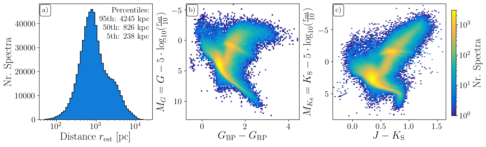

# Useful links and processing files of GALAH+ DR3

This repository accompanies GALAH+ DR3 and its release paper.

## Useful links:

### GALAH+ DR3 paper (Buder et al., 2020, MNRAS, submitted
[arXiv:2020.XXXXX](https://arxiv.org) or [on DataCentral](https://docs.datacentral.org.au/documents/34/galah_dr3_201105.pdf)

### GALAH+ DR3 catalogs
[FITS files on DataCentral](https://datacentral.org.au/teamdata/GALAH/public/GALAH_DR3/)
You can download the catalogs via wget.

### Additional Datacentral Tools:
[TAP](https://datacentral.org.au/vo/tap)
[Schema browser](https://datacentral.org.au/services/schema/)

### [Tutorials](https://github.com/svenbuder/GALAH_DR3/blob/master/tutorials/)
on how to get the data from the terminal (via wget), print the keywords, plot spectra (once downloaded)

## Content of this repository:

This repository is ment to allow other researchers to dive into the nitty-gritty details of the spectroscopic analysis. We provide the most important tools used for the SME analysis, the selection of linelist, and all code used for the post-processing (from collected SME results to final main catalog, including flagging and validation scripts).
  
### 1) input  
This directory includes the information that WG4 has received from WG3 (Reduction) as well as additional information on performed crossmatches and external information (such as asteroseismic values). Here we also plot a first overview of the data:



The final FITS file with input data is called "sobject_iraf_53_2MASS_GaiaDR2_WISE_PanSTARRSDR1_BailerJones_K2seis_small.fits".

The X-MATCH with Skymapper DR3 was performed by Chris Onken via gaia_dr2.source_id.

From WG3, we also received numerous catalogs with t-SNE flags. These are saved at [input/tSNE/](https://github.com/svenbuder/GALAH_DR3/tree/master/input/tSNE/).

We also have a list of [neglected_sobject_ids](https://github.com/svenbuder/GALAH_DR3/tree/master/input/neglected_sobject_ids), for which either reduction output or Gaia data were not useful.

### 2) analysis

#### a) stellar parameters
- The IDL script used to run the stellar parameter estimation, [galah_sp.pro](https://github.com/svenbuder/GALAH_DR3/tree/master/analysis/stellar_parameters/galah_sp.pro)
- The final selection of lines used for the [DR3_Sp](https://github.com/svenbuder/GALAH_DR3/tree/master/analysis/stellar_parameters/DR3_Sp.dat) estimation, as well as the continuum segments, [DR3_Segm](https://github.com/svenbuder/GALAH_DR3/tree/master/analysis/stellar_parameters/DR3_Segm.dat).

#### b) abundance_estimation
- The IDL script used to run the element abundance estimation, [galah_ab.pro](https://github.com/svenbuder/GALAH_DR3/tree/master/analysis/abundances/galah_ab.pro)
- The final selection of masks (line center, line mask, continuum mask): [mode_DR3](https://github.com/svenbuder/GALAH_DR3/tree/master/analysis/abundances/mode_DR3)
- A jupyter notebook [convert_mode_dr3_to_tex.ipynb](https://github.com/svenbuder/GALAH_DR3/tree/master/analysis/abundances/convert_mode_dr3_to_tex.ipynb) to convert this list into tex format.
- The IDL script used to run the upper limit estimation for element abundance, [galah_limits.pro](https://github.com/svenbuder/GALAH_DR3/tree/master/analysis/abundances/galah_limits.pro)

#### c) collection routine
- The IDL script used to collect SME output files into FITS files, [galah_collect.pro](https://github.com/svenbuder/GALAH_DR3/tree/master/analysis/galah_collect.pro)

#### c) tests used to improve the setup
- Which lines should be used and which continuum regions should be selected. A test was performed for 10000 randomly chosen spectra, see [select_masks](https://github.com/svenbuder/GALAH_DR3/tree/master/analysis/abundances/tests/select_masks).  
- Is the linelist data correct? We plotted the individual lines and their [linelist_data](https://github.com/svenbuder/GALAH_DR3/tree/master/analysis/abundances/linelist_data).
- We did performance tests on the computational performance in order to estimate runtimes, [performance_tests](https://github.com/svenbuder/GALAH_DR3/tree/master/analysis/performance_tests).

### 3) Processing

#### galah_output_structure.ipynb
- This notebook sets up the keywords for the [processed_files/](https://github.com/svenbuder/GALAH_DR3/tree/master/processing/processed_files), saved in [galah_dr3_output_structure.fits](https://github.com/svenbuder/GALAH_DR3/tree/master/processing/galah_dr3_output_structure.fits).

#### process_sme_results.ipynb
- This notebook takes the [sme_result_files/](https://github.com/svenbuder/GALAH_DR3/tree/master/processing/sme_result_files) files and processes them, i.e. estimates final uncertainties, combines abundances measurements, and performs flagging. results are saved under [processed_files/](https://github.com/svenbuder/GALAH_DR3/tree/master/processing/processed_files).
- For internal purposes: This notebook was formerly known as *create_data_products.ipynb*

#### create_main_catalog.ipynb
- This notebook takes the [processed_files/](https://github.com/svenbuder/GALAH_DR3/tree/master/processing/processed_files), combines them, and post-processes them to create the final main catalog, [catalogs/GALAH_DR3_main.fits](https://github.com/svenbuder/GALAH_DR3/tree/master/catalogs/GALAH_DR3_main.fits).
- For internal purposes: This notebook was formerly known as combine_10k_subsets.ipynb

### 4) validation

#### a) repeat_observations
- A notebook to estimate precision for same/different fibres, [estimate_repeat_uncertainty.ipynb](https://github.com/svenbuder/GALAH_DR3/tree/master/validation/repeat_observations/estimate_repeat_uncertainty.ipynb)

#### b) stellar_parameters
- GBS **STILL TO BE FINALISED**
- gaia_radial_velocity_differences.ipynb **STILL TO BE FINALISED TOGETHER WITH TOMAZ**
- asteroseismology: see *input/asteroseismic_information/* **STILL TO BE FINALISED TOGETHER WITH SANJIB/DENNIS**

#### c) abundances
**FINALISE THIS DESCRIPTION**
- A notebook to estimate abundance zeropoints, [abundance_zeropoints.ipynb](https://github.com/svenbuder/GALAH_DR3/tree/master/validation/abundances/abundance_zeropoints.ipynb).
- abundance zeropoints: we have estimated abundances from a skyflat as well as arcturus
- We have performed tests around the best fit for both sun and arcturus (*SME_sun_arcturus_abundance_variations/* including SME setup to *test_all_abundance_variations.pro*)
- We have created an overview of the abundance zeropoints (*abundance_zeropoints_overviews/*)
- **Check again: What does Plot_line_by_line_abundances.ipynb do?**
- **Check again: What does abundance_differences_line_of_same_element.ipynb do? Plots histograms of differences between lines of same element**

#### d) flagging
**FINALISE THIS DESCRIPTION**
- *flagging/binarity/birko_binarity.ipynb*: see Zwitter email from 200205 re. Birko et al. 2019 (AJ, 158, 155)

#### e) comparisons with other data
**FINALISE THIS DESCRIPTION**
- Clusters: **comparison_clusters/** include HERMES_OC_Gaia_distances.fits from Spina (email 191205)
- GALAH DR2
- SDSS-IV / APOGEE DR16 **redo with DR16 abundances** see /validation/APOGEE_comparison/Comparison_GALAH_iDR3_APOGEE_DR16beta.ipynb
- LAMOST VAC by Xiang et al.
- Solar twins: **already copied spina/bedell. do plots**

### 4) catalogs
This directory includes either links to VAC descriptions or the direct scripts that were used to compute them.

### 5) spectra
This directory includes tools to plot spectra, identified via **sobject_id**. This includes both *observed* as well as *synthetic* spectra (if available).

## Processing the data from beginning to end:

**1) You need the GALAH-SME pipeline.**  
Ask Sven Buder or Karin Lind for access. NB: We are working on a non-IDL/Python version post-DR3. For the DR3 analysis, however, we use RSAA's AVATAR machine and IDL.  
- SME files Directory: /avatar/buder/trunk, including GALAH/DATA/sobject_iraf_53_2MASS_GaiaDR2_WISE_PanSTARRSDR1_BailerJones_K2seis_small.fits, [GALAH/DATA/DR3_Sp.dat](https://github.com/svenbuder/GALAH_DR3/tree/master/analysis/stellar_parameters/DR3_Sp.dat), [GALAH/DATA/DR3_Segm.dat](https://github.com/svenbuder/GALAH_DR3/tree/master/analysis/stellar_parameters/DR3_Segm.dat), [GALAH/IDL/galah_sp.pro](https://github.com/svenbuder/GALAH_DR3/tree/master/analysis/stellar_parameters/galah_sp.pro), [GALAH/IDL/galah_ab.pro](https://github.com/svenbuder/GALAH_DR3/tree/master/analysis/abundances/galah_ab.pro), [GALAH/IDL/galah_collect.pro](https://github.com/svenbuder/GALAH_DR3/tree/master/analysis/galah_collect.pro)
- You need to copy GALAH spectra into GALAH/SPECTRA/dr5.3, sorted by date (YYMMDD/standard/com or YYMMDD/standard/com2 for repeat observations)  
- You need to create the specific FIELDS to run, e.g. GALAH/GALAH_190209_lbol  
  
**2) Run the files through the SP pipeline:**  
- create the PBS routines:  
```idl
create_pbs_avatar,'190209_lbol',mode='Sp',runs_per_node=10000
```  
- run SP pipeline:  
```idl
-rt=galah_sp.sav -args GALAH_190209_lbol 190209000101123 DR3  
```  
- Collect those results:  
```idl galah_collect,'GALAH_190209_lbol',sp='Sp',/offset_lbol,dir='OUTPUT_190209_lbol'  
```  
This will also create a 'GALAH_190209_lbol_NoTech' file with converged SP runs (safety copy: GALAH_DR3/processing/NoTech_Sp)

**3) Run the files through the AB pipeline:**  
- Create the PBS routines:  
```idl
create_pbs_avatar,'190209_lbol',mode='all',runs_per_node=10000  
```  
- Run AB pipeline:  
```idl
-rt=galah_ab.sav -args GALAH_190209_lbol 190209000101123 DR3 Li6708  
```  
- Collect all results:  
```idl
galah_collect,'GALAH_190209_lbol',/offset_lbol,dir='OUTPUT_190209_lbol',/silent  
```  
- Run upper limit routine:  
```idl
galah_limits,'190209'  
```  

**4) Process SME results:**
- Copy SME result files (GALAH_190209_lbol_final.fits) to GALAH_DR3/processing/sme_result_files/  
- If not done already, create the file GALAH_DR3/validation/abundances/galahdr3_abundance_zeropoints.fits:   
```jupyter notebook:
GALAH_DR3/validation/abundances/abundance_zeropoints.ipynb  
```  
- If not done already, create the galah_dr3_output_structure.fits:  
```jupyter notebook:
GALAH_DR3/processing/galah_output_structure.ipynb  
```  
- Process individual SME result FITS:  
```jupyter notebook: 
process_sme_results.ipynb  
```  
- Combine processed files:  
```jupyter notebook:
create_main_catalog.ipynb  
```
