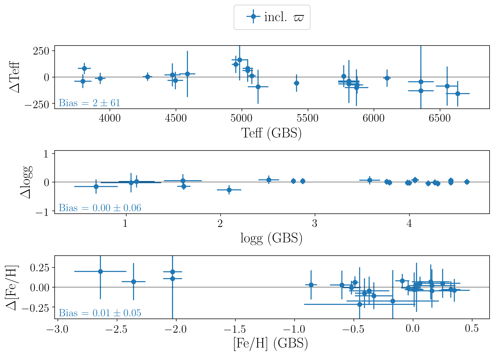
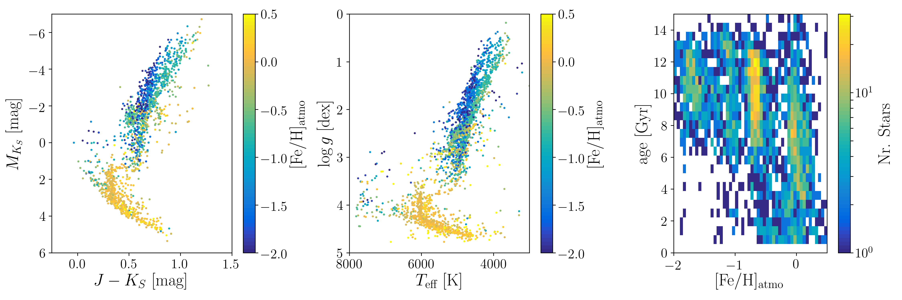

Repository for diagnostics of GALAH DR3
---------------------------------------

AUTHOR
-------

Sven Buder (**SB**, MPIA, WG4): buder at mpia dot de

OVERVIEW
--------

This repository includes the following subsets for GALAH DR3

**Input**:

This part is based on the input from WG3 (**sobject_iraf_53.fits**).

This file has been extended with ADQL-based x-matches with 2MASS, <i>Gaia</i> DR2 (incl. Bayesian distances from Bailer-Jones+2018), AllWISE, PanSTARRS DR1, and asteroseismic data from K2.

**Performance for Gaia FGK Benchmark stars (Jofre+2018) and stars with asteroseismic information**:

We compare with the values from Vizier/III/281/gbs (Jofre+2018, arXiv:1808.09778) as well as the difference in the performance for stars when also nu_max values are available to constrain logg:

We do not see any significant biases for Teff and logg, but had to correct and [Fe/H] bias of -0.1 (underestimated [Fe/H]).

The overlap of the stars with asteroseismic parameters and parallaxes show that the bolometric pipeline (middle panels) performs significantly better than the pipeline without additional non-spectroscopic information (left panels). Especially the Red Clump stars show an outstanding agreement with the pipeline results which also used nu_max values.

The scatter in the differences between asteroseismic and bolometric pipeline for logg is mainly driven by the red clump stars, which have to be further investigated, but are significantly better than for GALAH DR2.

")

The biases between asteroseismic and bolometric pipelines for the stellar parameters are not significant but show a trend of lower Teff (-21K), lower logg (-0.03dex), and lower [Fe/H] (-0.03dex) than the values from the pipeline using asteroseismic values/relations for logg.

**Abundance zeropoints**

The current abundance zeropoints for the Sun and Arcturus are very small for light elements but need further analyses for the heavy elements.

**Clusters**:

Plotted are all globular and open clusters members (based on the membership analysis by Janez Kos from 180507 and if SME parameters available):

Left: CMD, middle: Kiel diagram, right: 2D-histogram of ages and [Fe/H] of all cluster stars

**Dynamics**:

 GALAH sample")